### Contents

- [Problem Definition](https://mlk-713.github.io/cs766_project/#problem-definition)
- [Motivation](https://mlk-713.github.io/cs766_project/#motivation)
- [Approach](https://mlk-713.github.io/cs766_project/#approach)
- [Implementation](https://mlk-713.github.io/cs766_project/#implementation)
- [Results Discussion](https://mlk-713.github.io/cs766_project/#results-discussion)
- [Conclusion](https://mlk-713.github.io/cs766_project/#conclusion)
- [Gallery](https://mlk-713.github.io/cs766_project/#gallery)

## Problem Definition
  For our project we decided to create a computer vision program that is capable of "playing" the game pick-up sticks.  In the game of pick-up sticks, players take turns trying to remove sticks from a random pile without disturbing the other sticks.  During their turn, a player can continue to pick up individual sticks until they either cause a disturbance or deplete the pile.  With this in mind, we focused on designing a program capable of describing an optimal order in which to continuously pick up sticks without disturbing other sticks.  To help maintain a reasonable scope for the project we decided to ignore the point system and advanced rules of pick-up sticks.  We also required that each stick be a unique color, which also ended up limiting the max number of sticks we could include in our test images.  This gave as a simple, clearly defined goal for the project; given an image of a simple pile of sticks, describe a best order in which to pick them up.

## Motivation

  We primarily decided on this project because we thought it would be a fun, easily understandable problem to approach.  It also felt like the game of pick-up sticks could naturally be extended to the more important problems.  For example, clearing rubble in search and rescue shares the importance of minimal disturbance while removing items. Furthermore, while researching possible approaches we learned that most, if not all, related research on the topic is based on machine learning techniques.  Thus it was enticing to think we were pursuing a novel approach to this type of problem.

## Approach
  The objective of our project is similar to that of a well known problem, bin picking.  In bin picking, the goal is to identify objects in a bin and how to best retrieve them. The key difference between pick-up sticks and bin picking is the need to remove objects without interfering with other objects.  As mentioned above, most bin picking technology is based in machine learning.  So, it is likely that we could have readily adapted existing machine learning approaches to our problem.  However, we decided to instead pursue an algorithm based approach since it seemed to be unexplored and we were not up to the task of creating a large enough dataset for machine learning techniques.
  With this in mind we split the design into three key components.  First, we had to identify sticks and the points at which sticks overlap.  Second, we need to determine which stick is on top of the other at said overlap points.  Third, using all these features, we needed to create a digraph to represent the pile of sticks and compute a topological order.  Completing these three components would be synonomous with completing the project, and this understanding helped us keep a steady pace while implementing our design.

## Implementation
  Our first step was to create a collection of images to use for the project.  We started by experimenting with a few different backgrounds, but eventually settled on just using a simple black paper background.  Once that was decided, we positioned a camera above the scene and captured multiple sample images without changing its position.  The images captured this way were zoomed out farther than desired, so we then cropped them all to better focus on the region of interest while keeping them all the same size.  Of these images, we will use the following image as a running example throughout our explanation of our implementation, and include other examples in the [gallery](https://mlk-713.github.io/cs766_project/#gallery).
  
  
  
  Now, given these pictures, we first tried to clean them up.  After some experimentation, we decided to use an abuse of hough line detection to identify the lines that represented the pickup sticks. This required converting the image to black and white. Unfortunately, our background was not precisely black, or otherwise this would be quite trivial. Because of this, we first converted these images to grayscale, and utilized the following imbinarize code:
  
```matlab
bw_img=imbinarize(trim_gray_img,'adaptive','ForegroundPolarity','bright','Sensitivity',0.5);
```

  This got us pretty clean black and white image to work with, and we used dilation and erosion to finalize the cleaning process. Next, we needed to find the lines representing the pickup sticks. We utilized Hough peaks and Hough lines in order to do so: 

```matlab
[H,T,R] = hough(clean_img);
P  = houghpeaks(H,6,'threshold',ceil(0.5*max(H(:))));
lines = houghlines(clean_img,T,R,P,'FillGap',5,'MinLength',7);
```

  However, these hough lines weren’t the most clean. While they did encompass the 6 pickup sticks, there were also noise hough lines that were either very short or very long. Thus, we went through and found the average length of the hough lines in hopes that this represented the general length of the pick-up sticks.  Then we used this average length to only select hough lines that fit within a boundary of this average. This yielded great results, as seen below.
  
  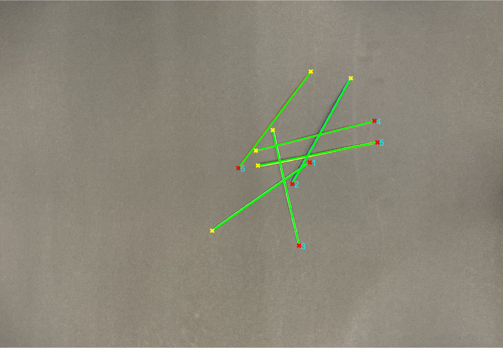

  Once we had the lines, we needed to figure out where the sticks intersected, since those are the points of interest in a game of pick-up sticks. In order to do so, we utilized the line endpoints to determine all the lines' equations, which we then used to find every possible intersection. This required (n-1)+(n-2)+...+(1) calculations, which isn’t too bad. Finally, since intersections can be a point in the distance where the points eventually intersect, we only save the intersections that lie within the region of interest for both of the lines.  This gave us the following output when the intersections were plotted with the lines.
  
  

  While identifying the intersections we also recorded the lines that created the intersections, and the next challenge was identifying the which of these lines represented the stick at the top. This is where our assumption that sticks were all different colors came into play. This assumption allowed us to do pixel analysis on the original image to identify the top stick. We essentially took both lines involved, and ran:

```matlab
improfile(img,line_x,line_y)
```

  This function helped us analyze the pixel intensities of the color channels. We then looked at the two lines involved in each intersection, and calculate their average pixel intensities across the entire line as a baseline. We also took a small region of interest around the intersection point, and averaged the pixel intensities there. Finally, we compared the profile of the region of interest with both of the lines in order to determine which line matched the region of interest the best.  This best match represented the stick on top. 

  Once we aquired the top stick information, we could then scan through all the intersections to create a digraph representing the pile.  In this representation, sticks were converted to nodes and overlap points became edges such that an edge started at the node representing the top stick and ended at the node representing the bottom stick.  We did this in the code by creating a matrix representation of the digraph.  We then called the graph() function on the matrix to get our digraph.
  
  (Our running example's digraph, adjusted slightly for clarity, is pictured with the stick labels shown in an image for reference.)
  
  <p align="center">
  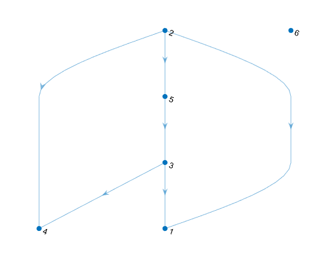 
  </p>
  
  Using the digraph representation, we simply called the toposort() function and got a topological ordering of the nodes, and therefore the sticks.  As a final step we modified this order to prioritize isolated sticks as first in the order.  Once that was done, we had our order for picking up the sticks and could display it on the original image as our final output:
  
  

  Finally, we also looked at the possibility of detecting load imparting sticks, sticks that weigh down other sticks. Removal of load imparting sticks could cause affected sticks to tilt or move. While the algorithm is far from perfect due to time constraints, it provides a proof of concept for feasibility of accomplishing this task. Our algorithm first looks at sticks which could be affected by load imparting sticks. Essentially, we looked at all the intersection points that are associated with each stick, and only consider a stick to be potential load bearing stick if it has two or more intersection points (because it needs a pivot intersection underneath and a weight intersection on top). If a stick has two or more intersections and at least one intersection above and below, we attempt to find the right most and left most pivot. The intuition here is that any stick underneath another either to the right but not the right most or to the left but not left most cannot act as a pivot stick. Once we determied the pivot points, we check any sticks on top of the load bearing stick, and determine if it lies further away from the center than the pivot point. If it does, it should be classified as a load imparting stick and flagged with an "lb?" as a warning in the output.
  
  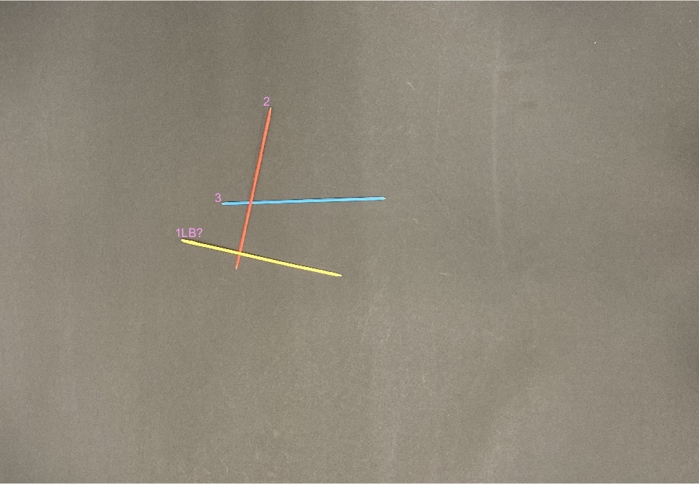

## Results Discussion
  Manual inspection of the output orders from our program showed that our algorithm and implementation worked well.  We tested a diverse collection of images with 3 or 4 differently colored sticks, as well as images with more sticks or load bearing sticks. In each case, the algorithm was able to correctly identify the sticks in question, and the ordering of sticks from top to bottom. The load bearing algorithm also identifies which sticks could be potentially load imparting, though there are improvements to be made. Notably, if there are multiple sticks that could be load imparting but can be removed in such a way that results in no disturbance, our algorithm just labels all possible load imparting sticks, and assigns them a position in the order as usual without consideration of possible orders that address the load bearing issue. Another problem is the difficulty of accounting for the weight of the pick-up sticks, and in our load bearing results, we occasionally mislabel non-load imparting sticks as possibly load imparting because the sticks didn't have enough weight to pivot the sticks below them.  Due to this, we left load bearing as an optional feature of our final program, requiring "load bearing" to be passed as an argument to our control function, runProject().
  
  We also have many other ideas for improving our current implementation.  First of all, we could improve our implementation of stick identification. Currently we use a hough line detection method, but there might be smarter and more robust ways to identify pickup sticks. Alternatively, we could also focus on honing the hough line method to work better on large numbers of sticks, which is currently it's primary weakness.  Also, figuring out a method to determine which stick is on top at each intersection that doesn't rely on color is important. In a game of pickup sticks, there are often many sticks with the same color, and if they overlap each other, our algorithm currently would have a difficult time identifying which stick is on top.  Our code for computing the order using the intersection data could also be improved to make our algorithm prioritize sticks that become isolated after the removal of another stick.  We could also add a check for interwoven sticks that cannot be cleanly picked up by checking for a cycle in the representative digraph.  This case never came up while making our own piles so we have left it unaddressed.  One more improvement would be to modify the load bearing algorithm. The current version could be adjusted to account for the weight of the pick-up sticks, since that affects whether a stick is truly load bearing.  Finally, another improvement could be to set up a score on difficulty of removal. For example, just because a stick is on top, doesn't mean it's the easiest stick to remove without disturbing other sticks.
  
## Conclusion

  Overall, while we are aware of numerous possible improvements to our project, we are very happy with what we have achieved up to this point.  We managed to create a working algorithmic approach using nothing but a few convenient library functions and our own ingenuity.  It has its flaws, and it required a fair bit of effort to figure out the different aspects of the implementation, but we have a working final result and we both learned a lot.  As a result, we are quite happy with our project, and look forward to future studies.
  
## Gallery

Note that most images are ran without the "loadbearing" option.  Since the warning labels are not a gaurantee of load bearing issues in our current design we left them off for the images we knew did not have load bearing features.  If you're curious to see which ones get load bearing flags anyways, you can use the same runProject example call with the "loadbearing" option after the stick count.  For example, `runProject("rand_mc_6_4.JPG", 6, "loadbearing")` flags a stick that is not actually an issue.

- Our most basic example: 
  `runProject("simple_mc_3_1.JPG", 3)`

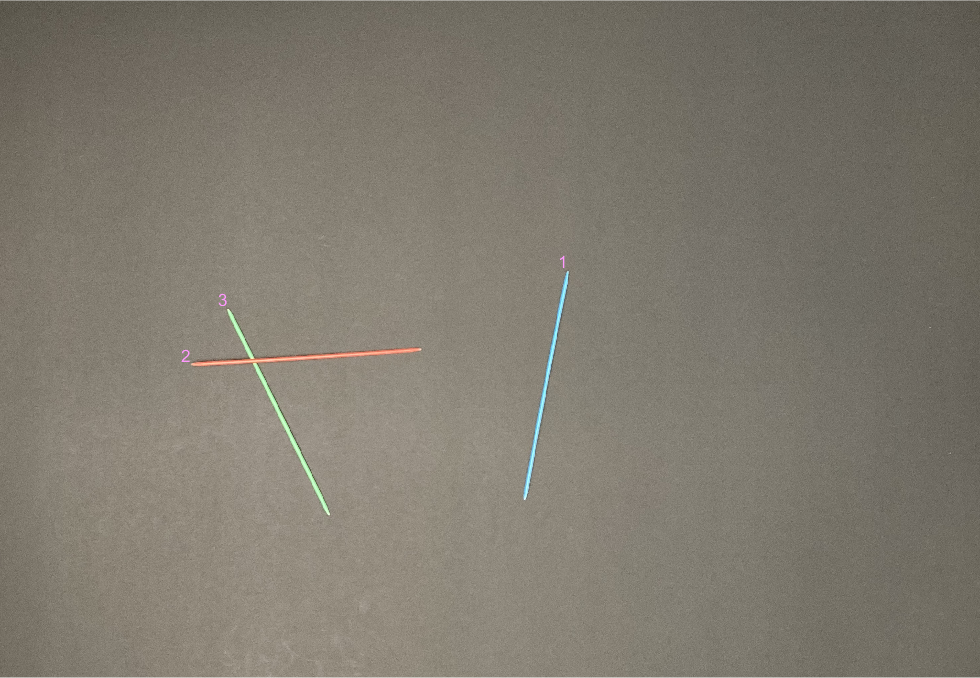

- `runProject("simple_mc_3_2.JPG", 3)`

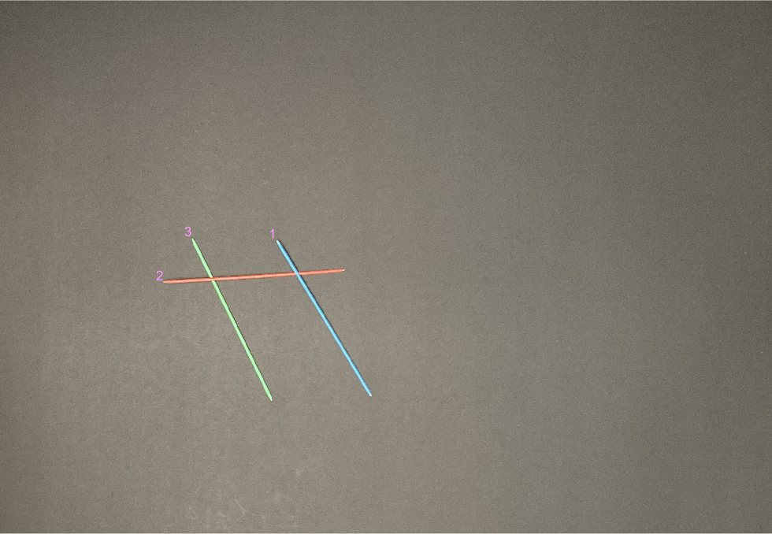

- A sanity check image to make sure our code did not break when no overlap points were present: 
  `runProject("simple_mc_4_0JPG", 3)`

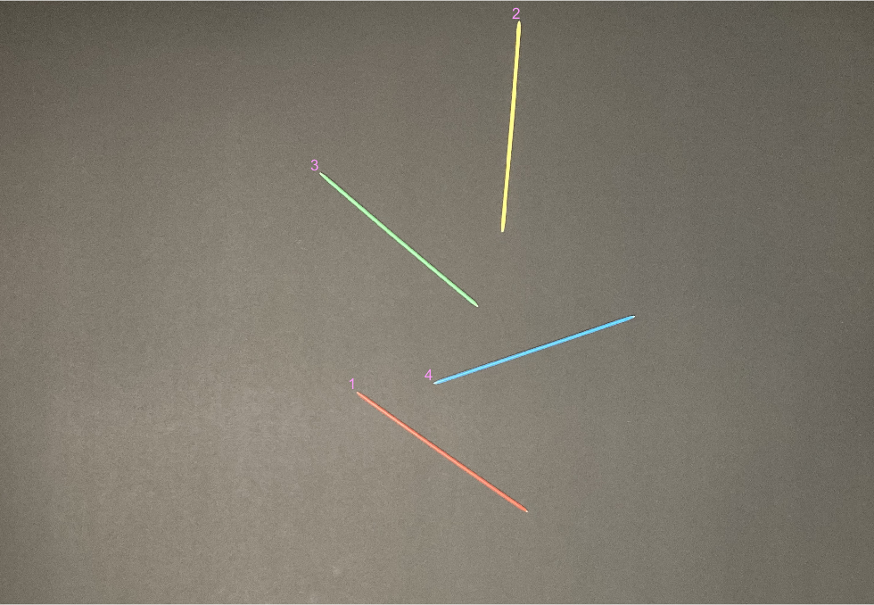

- `runProject("simple_mc_4_1.JPG", 4)`

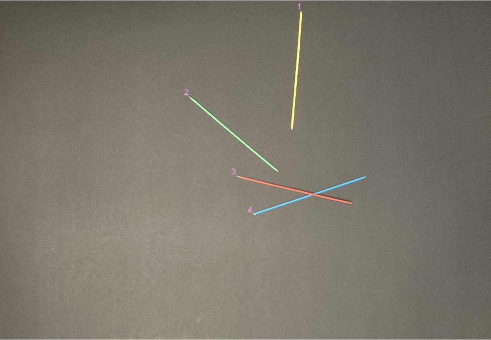

- `runProject("simple_mc_4_2.JPG", 4)`

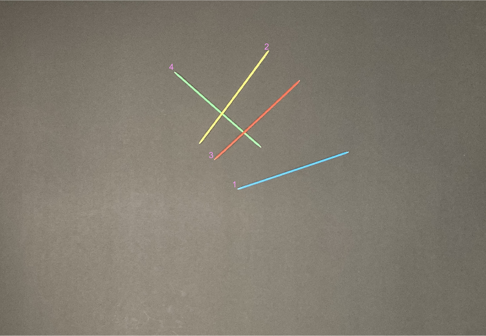

- `runProject("simple_mc_4_3.JPG", 4)`

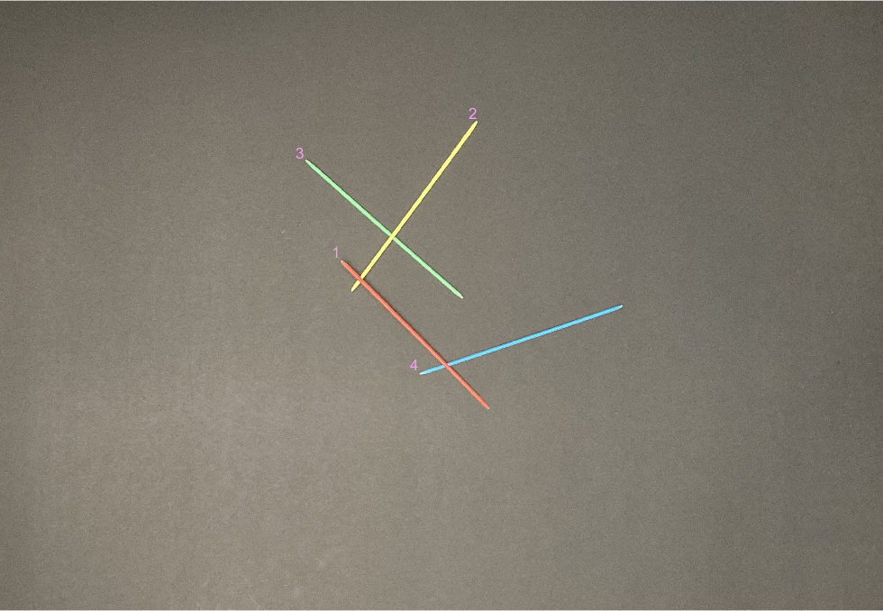

- `runProject("simple_mc_4_4.JPG", 4)`


- `runProject("simple_mc_4_5.JPG", 4)`

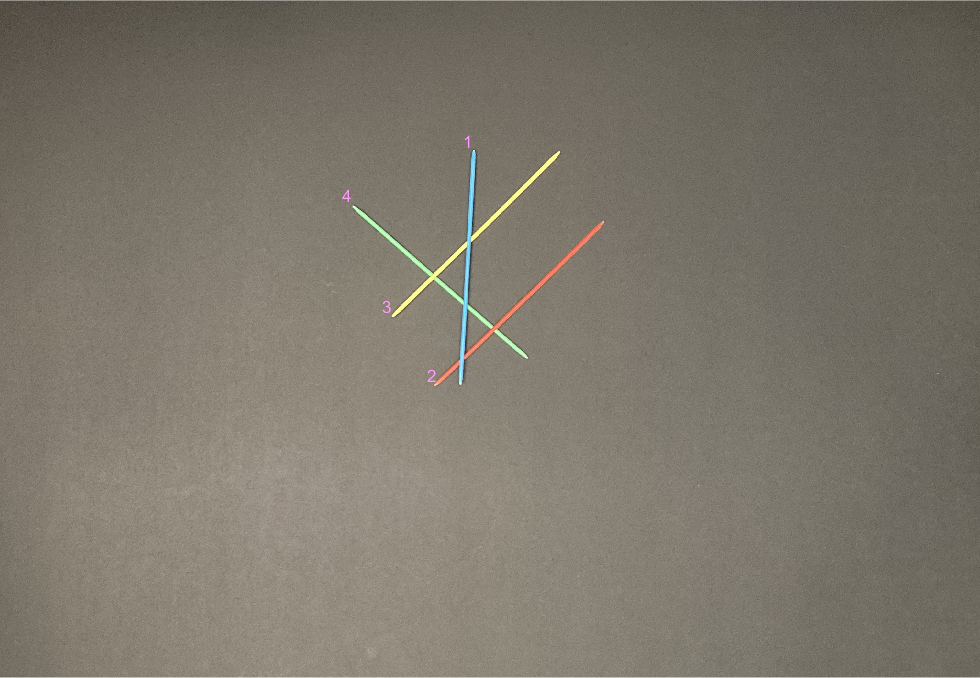

- An adversarial image with 13 intersetions: 
  `runProject("simple_mc_6_13.JPG", 6)`

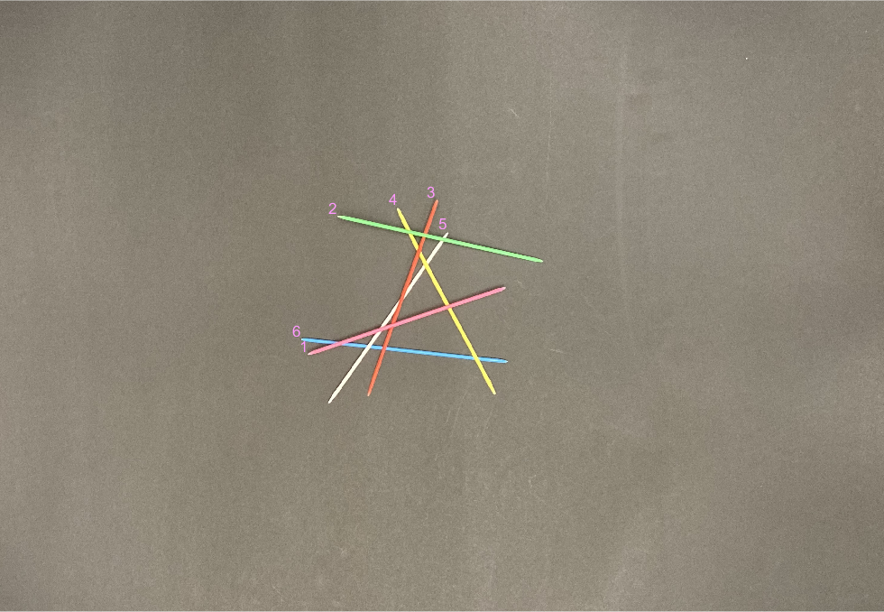

- One of many random piles we made according to the game rules of dropping the sticks: 
  `runProject("simple_mc_6_1a.JPG", 6)`

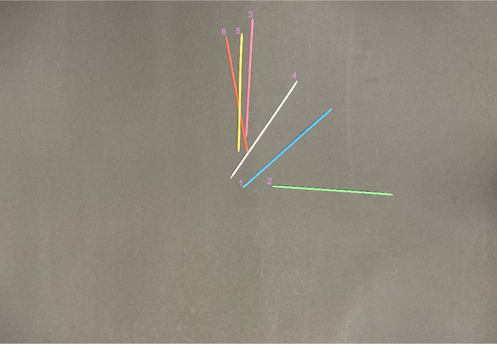

- Here you can see our line detection being stressed: 
  `runProject("simple_mc_6_1b.JPG", 6)`

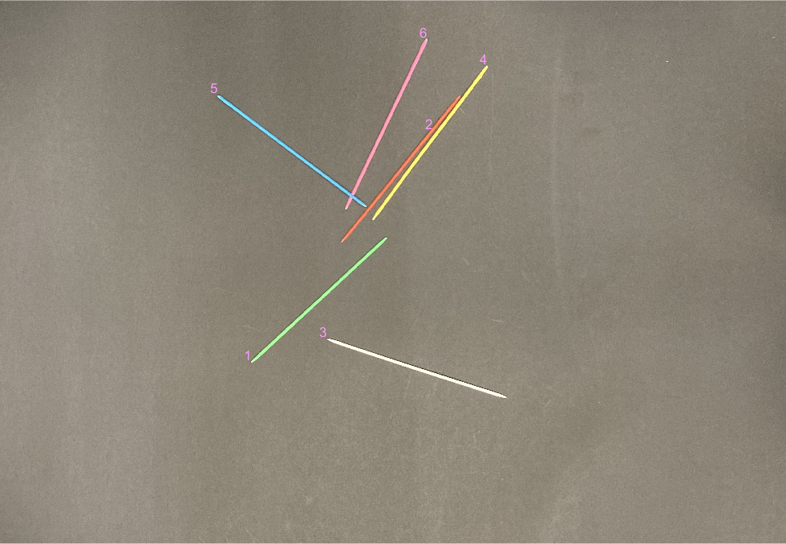

- One of the more interesting random piles we tested on:
  `runProject("simple_mc_6_4.JPG", 6)`

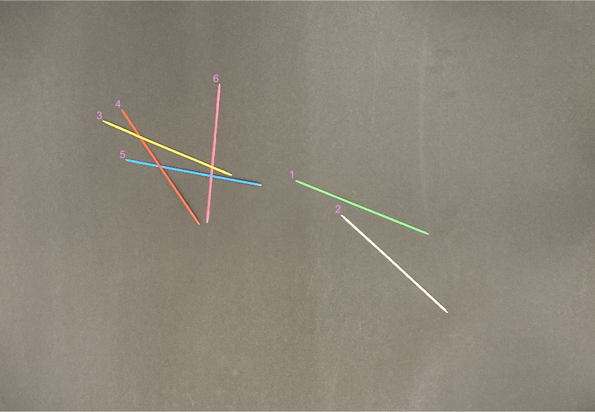

- Another load bearing example which shows how our code just labels the potential issue sticks even if some are fine to pick up: 
  `runProject("load-bearing_2.JPG", 4, 'debug', 'loadbearing')`

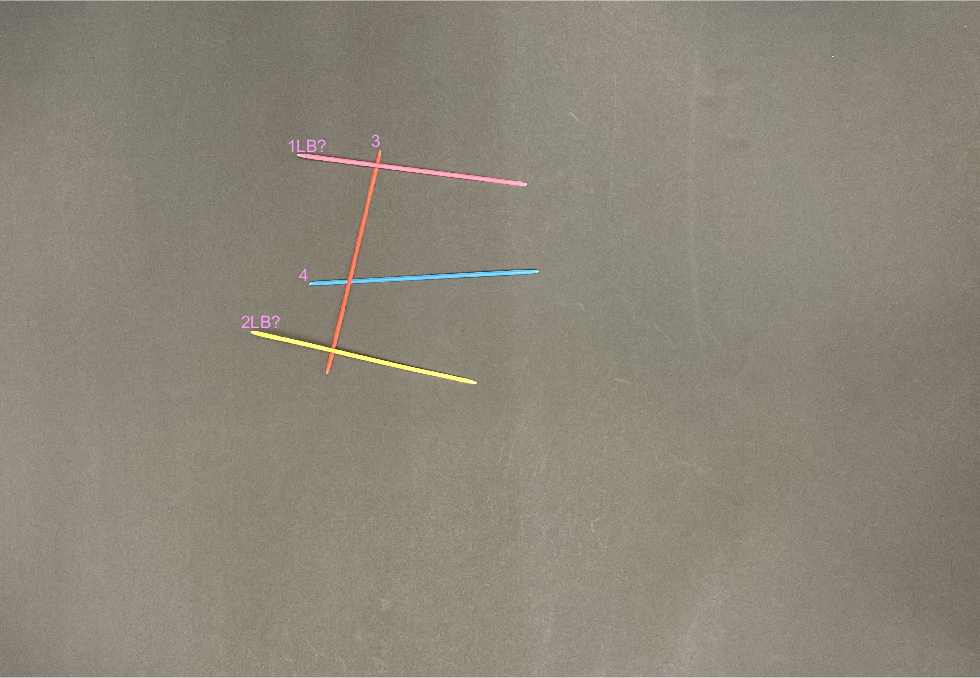
